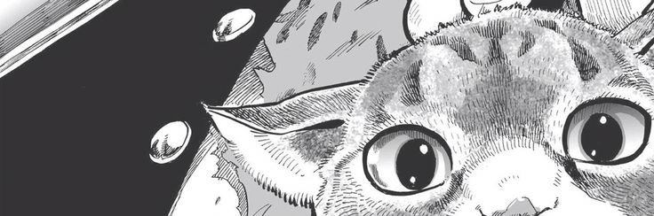

  

# 🌟 About Me:
- still learning  
- still breaking things  
- still fixing them again  

---

# 🧠 Currently Into: 
- ⚙️ building random tools  
- 🧩 solving weird problems  
- 💤 sleeps

---

# 💻 Tech Stack:

---

# 📊 GitHub Stats:

  

